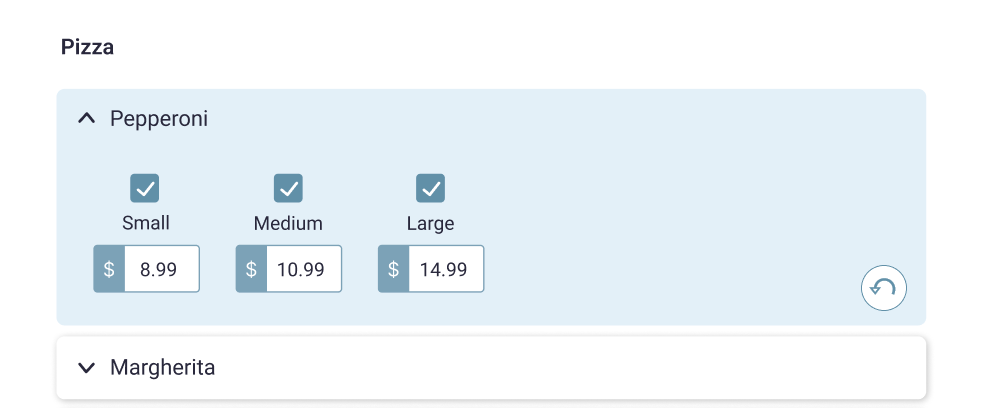

Project goals
# Description

The following design: 

depicts a part of an online ordering menu.

* Imagine a Pizza menu category that has a few items, and each item has sizes and prices for each size
* Each item card on the design works **_like_** a bootstrap accordion (see https://getbootstrap.com/docs/5.0/components/accordion/)
* When you click on the item name the size/price section expands. At the same time the other item cards collapse
* When you uncheck a size, the related price is set to 0.00, and the input above is disabled
* User can edit the price (only numbers are allowed). Price changes **persist after page refresh**
* Each item card has an "Undo" button/function, which is **only displayed** if the user has made any changes to item since the app initialized. When clicked, the selected item's state reverts to the initial one (**what we had when the page first loaded**)

Given the data and their models:
[data.ts](./data.ts)

1. Fork this repository on your account
2. Build a web app that matches the above design and functionality described above, using the available data
3. Send us the forked repo with your changes when you are ready

## Notes
1. You can use any of the recent Angular versions (at least v15+)
2. Avoid using any 3d-party dependencies, like state management tools, component frameworks, or CSS libraries. Write your own styles to match the mockup design
3. Try to make the app accessible based on the [WCAG 2.1 (AA) standards](https://www.w3.org/WAI/standards-guidelines/wcag/)
4. You can import or copy the data from `data.ts` file any way you want
5. You can use any of the available browser features/APIs to persist data between page reloads
6. The relations between the data use a classic relational approach (id based)
7. The undo function is performed **per item** and should work for _any item list length_
8. Try to use best practices as you would always do. Don't focus only on functionality or styling only

# Assesment

This project was generated with [Angular CLI](https://github.com/angular/angular-cli) version 17.1.0.

## Development server

Run `ng serve` for a dev server. Navigate to `http://localhost:4200/`. The application will automatically reload if you change any of the source files.

## Code scaffolding

Run `ng generate component component-name` to generate a new component. You can also use `ng generate directive|pipe|service|class|guard|interface|enum|module`.

## Build

Run `ng build` to build the project. The build artifacts will be stored in the `dist/` directory.

## Running unit tests

Run `ng test` to execute the unit tests via [Karma](https://karma-runner.github.io).

## Running end-to-end tests

Run `ng e2e` to execute the end-to-end tests via a platform of your choice. To use this command, you need to first add a package that implements end-to-end testing capabilities.

## Further help

To get more help on the Angular CLI use `ng help` or go check out the [Angular CLI Overview and Command Reference](https://angular.io/cli) page.
